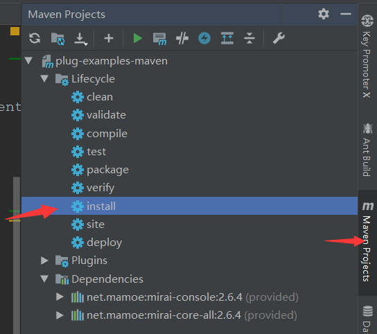
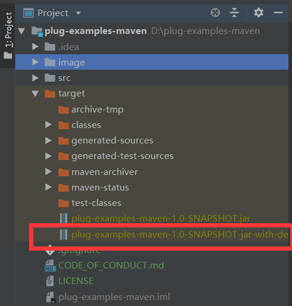

## Plug-examples-maven

本项目为Mirai-console插件模板项目

开发体系为：Java + Maven

### 开发注意的问题
1. resources 下的 net.mamoe.mirai.console.plugin.jvm.JvmPlugin 请改为你的插件名,这边Maven会自动打包进去。
2. 请注意你的程序结构包名（这里用的是indi.eiriksgata.examples)，以免和别人插件冲突。
3. 请使用OpenJDK 11+

### 文件介绍
- MessageEventHandler 为QQ消息事件处理类
- MiraiAccessCore 为设置插件的版本，以及各种载入阶段的事件处理。

### jar生成
如果你是一名IDEA使用者，想必应该懂得如何快速的利用自带的插件来生成。

当然如果你不是IDEA，那么你可以使用Maven指令来实现。

